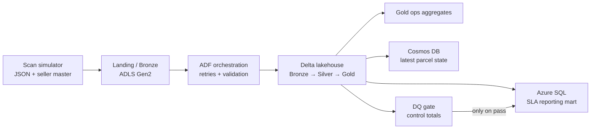

# Parcel Intelligence Platform on Azure

An end-to-end logistics data platform that turns messy parcel scans into three purpose-built serving layers: a customer tracking store, an operations lakehouse, and a finance-grade SLA mart. The repository runs completely on a laptop using Python's standard library; its `adf/`, `databricks/`, and `serving/` folders map directly to the Azure implementation.



## Recruiter demo (about a minute on a typical laptop)

```powershell
cd D:\azure-parcel-intelligence
python -m scripts.run_demo --parcels 1000 --seed 42
python -m serving.cosmos.lookup PAR00000001
python -m serving.azure_sql.report
```

The demo generates raw batches, performs idempotent bronze/silver/gold transformations, applies PII masking, runs quality gates, writes a SQLite stand-in for Azure SQL, and materializes one Cosmos-style JSON document per parcel. Outputs are written to ignored `data/` and `artifacts/` folders.

## What is demonstrated

| Consumer | Query | Store | Demo artifact |
|---|---|---|---|
| Customer | Current state for one parcel | Cosmos DB | `data/cosmos/parcel_state.jsonl` |
| Ops manager | Hourly hub backlog and breach risk | Lakehouse Gold | `data/gold/ops_hourly.jsonl` |
| Finance/SLA | Daily lane performance and breaches | Azure SQL | `data/serving/sla_mart.db` |

## Results to discuss

The simulator deliberately emits duplicate, out-of-order, incomplete, and late scans. Silver chooses the latest valid state by event time, hashes phone numbers, and preserves anomaly flags. The DQ control total blocks the SQL publication if delivered counts disagree between Gold and the mart.

> Three stores, one truth: finance publication is impossible until cross-store totals agree.

Run `python -m scripts.run_demo --parcels 200000` for the PRD-scale dataset. For a cloud deployment, replace the local path adapters with ADLS/Delta, execute the Databricks notebooks, import the ADF definitions, and use the same quality gate between Silver and Gold.

## Azure deployment notes

- `adf/` contains parameterized, secret-free pipeline templates and trigger definitions.
- `databricks/` contains notebook-compatible transformation examples and Delta SQL optimizations.
- `serving/azure_sql/ddl.sql` defines the reporting mart; `serving/cosmos/README.md` explains partitioning and RU sizing.
- `monitoring/` and `runbooks/` capture operational response steps and cost teardown.

Never commit secrets. Linked services use Key Vault reference placeholders only. Tear down Azure resource groups when a demo is complete to avoid charges.
